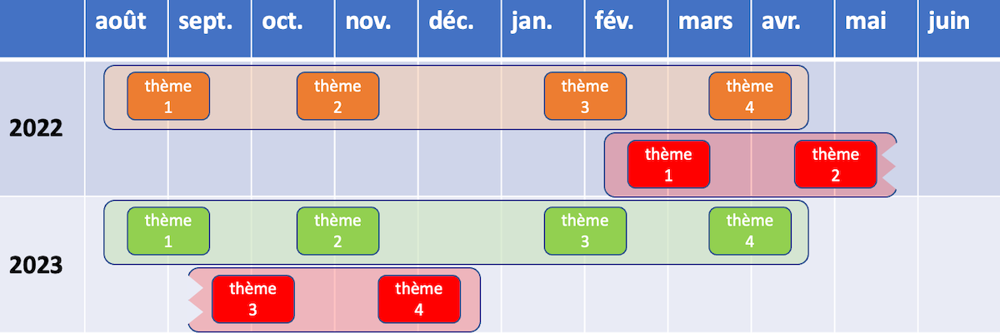

```{r setup, include=FALSE}
options(htmltools.dir.version = FALSE)
knitr::opts_chunk$set(
  fig.width = 9, fig.height = 3.5, fig.retina = 3,
  out.width = "100%",
  cache = FALSE,
  echo = TRUE,
  message = FALSE,
  warning = FALSE,
  fig.show = TRUE,
  hiline = TRUE
)
```

```{r xaringan-themer, include=FALSE, warning=FALSE}
library(xaringanthemer)
style_duo_accent(
  primary_color = "#D2202B",
  secondary_color = "#D2202B",
  inverse_header_color = "#FFFFFF",
  link_color = "#676C72",
    header_font_google = google_font("Josefin Sans")

)
```

class: title-slide, inverse, bottom
background-image: url(`r rmarkdown::metadata$url_unsplash`)
background-size: cover

# `r rmarkdown::metadata$title`

## `r rmarkdown::metadata$subtitle`

### `r rmarkdown::metadata$team`

### `r rmarkdown::metadata$date`

---
class: about-me, middle, center


## Formation continue HEP-VS

[`r icons::fontawesome("user-lock")` Stockage et versioning du projet (Intranet HEP-VS uniquement)](`r rmarkdown::metadata$url_intranet`)</br>
[`r icons::fontawesome("link")` Concept au 26.11.2021 (Equipe Teams de la formation)](`r rmarkdown::metadata$url_concept_up_to_date`) </br>
[`r icons::fontawesome("link")` Canal Teams (Conseil scientifique de la formation)](`r rmarkdown::metadata$url_canal_cs`)</br>
[`r icons::fontawesome("link")` Archive des présentations publiées](`r rmarkdown::metadata$url_archives`)

---
class: inverse, middle left

# Ordre du jour

--

### 1- Accueil

--

### 2- Commande par le client - Cadre de fonctionnement

--

### 3- Missions du CS - Marge de manœuvre

--

### 4- Identification des contenus - Décision

--

### 5- Identification des équipes - Premières réflexions

--

### 6- Divers

---

class: middle left

# 1- Accueil

--

### Composition du CS

- Myriam Squillaci (UNIFR), Andrea Samon (UniDistance), Lionel Alvarez (UNIFR), Corinne Monney (HEP-VS)

--


### Cahier des charges du CS

- (extrait) Identification des contenus des thèmes
- (extrait) Identification des équipes de formation
- (extrait) Positionnement sur les équivalences à l'entrée en formation

--

### Modalités de fonctionnement du CS

- 2 à 4 rencontres par an via Teams avec espace de collaboration virtuel

---

class: middle left, inverse

# 2- Commande par le client - Cadre de fonctionnement

--

### Formation obligatoire

--

### 44 heures d'exposition aux contenus

--

### Orientation terrain valaisan

--

### En 4 thèmes avec alternance comodal - asynchrone - personnel

--

### Généraliste


---

class: middle

# 3- Missions du CS - Marge de manœuvre

--

### Identifier les contenus des 4 thèmes de 11 heures chacun : 

- Eléments de psychologie cognitive : Attention, mémoire, fonction exécutives
- TSA et neurosciences : du diagnostic aux interventions
- Eléments de sciences affectives : développement émotionnel et compétences psychosociales
- Développer un projet d'intervention : outils, risques et opportunités

--

### Identifier les équipes capables d'intégrer le scénario pédagogique :

- Introduction théorique en comodal (3 heures participant·e)
- Mise en place et suivi de l'espace pédagogique Moodle avec interactions et présence (6 heures participant·e)
- Orientation vers l'implémentation en terrain valaisan (2 heures participant·e)

---

class: title-slide, inverse, middle
background-image: url("https://images.unsplash.com/photo-1429743305873-d4065c15f93e?ixlib=rb-1.2.1&ixid=MnwxMjA3fDB8MHxwaG90by1wYWdlfHx8fGVufDB8fHx8&auto=format&fit=crop&w=1734&q=80")
background-size: cover

--

# 4- Identification des contenus - Décision

---
class:middle, center

```{r out.width = '100%', echo=FALSE}
# local
knitr::include_graphics("img/anatomie.png")
```
### Anatomie d'un module

---

class:middle

# 4- Identification des contenus des 4 thèmes - Décision

--
### Mission

Figer les thèmes et contenus des 4 parties de la formation (4 thèmes de 11 heures chacun).

--

### Tâches relatives

1. Reformuler la notion centrale de chaque thème
1. Définir les notions-clés
1. Formuler un objectif de chaque thème
1. Rédiger une description

--

### Document de travail

[Document de travail pour l'élaboration des contenus de chaque thème](https://bit.ly/3p6x7ni)

---
class: title-slide, inverse, middle
background-image: url("https://images.unsplash.com/photo-1495474472287-4d71bcdd2085?ixlib=rb-1.2.1&ixid=MnwxMjA3fDB8MHxwaG90by1wYWdlfHx8fGVufDB8fHx8&auto=format&fit=crop&w=2940&q=80")
background-size: cover

--

# 5- Identification des équipes - Premières réflexions

---
class:middle, center
```{r out.width = '100%', echo=FALSE}
# local

```

### Organisation des sessions et planification des thèmes

---
class: middle

# 5- Identification des équipes - Premières réflexions

--

### Mission

Identifier les équipes susceptibles de piloter chaque thème de la formation :

- 4 thèmes de 11 heures chacun
- Chaque thème est donné 3 fois entre 2022 et 2024

--

### Tâches relatives

- Identifier des noms

--

### Document de travail

[Document de travail pour l'élaboration des contenus de chaque thème](https://bit.ly/3p6x7ni)

---
class: middle

# 6- Divers

---

class: middle

## Merci pour votre engagement !

```{r out.width = '10%', echo=FALSE}
# local
knitr::include_graphics("img/logo.png")
```

--

.pull-right[

Crédits photo par ordre d'apparition :

[Scott Graham](https://unsplash.com/photos/5fNmWej4tAA)

[Jens Lelie](https://unsplash.com/photos/u0vgcIOQG08)

[Nathan Dumlao](https://unsplash.com/photos/6VhPY27jdps)

]
